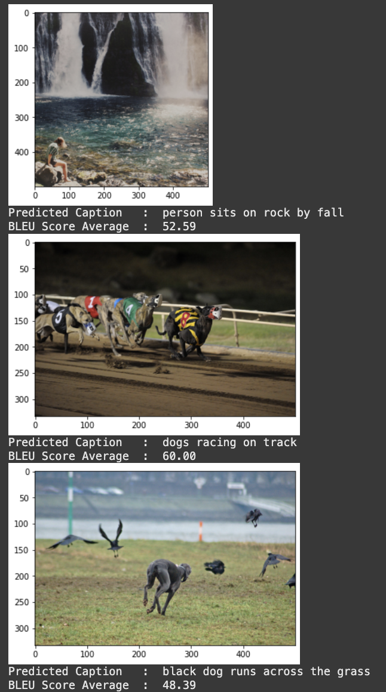
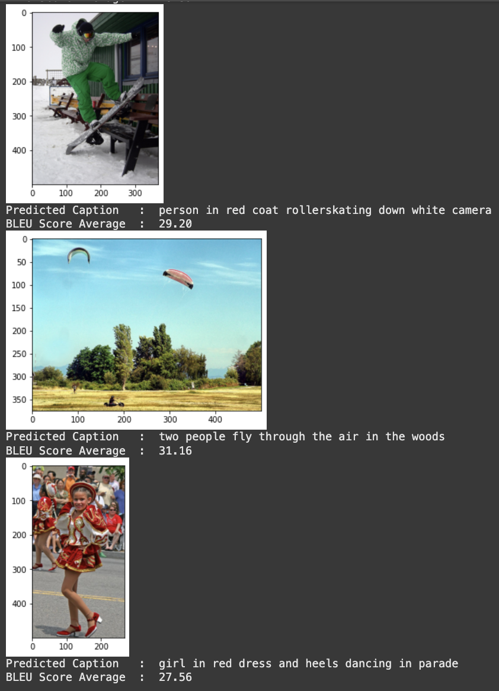

# 🖼️ Picture Captioning Using Deep Neural Networks

This project implements an end-to-end deep learning model that generates natural language captions for input images. Developed as part of the final year project for the M.Tech Integrated program at **Vellore Institute of Technology**, it uses **CNNs (InceptionV3)** for image encoding and **RNNs (LSTM)** for caption generation. The model is trained and evaluated on the **Flickr8k dataset**.

🔗 **Run this notebook in Google Colab**:  
[Open in Colab](https://colab.research.google.com/drive/1eoRDfoehgl4qInMFrdtIvGh2CyTh0ImD?usp=sharing)

---

## 🎯 Objective

- Automatically generate English captions for images
- Combine visual understanding (CNN) with language modeling (LSTM)
- Enable accessibility features like text-to-speech for visually impaired users

---

## 🧠 Model Overview

- **Encoder**: Pre-trained InceptionV3 CNN (without Softmax) generates a 2048-d feature vector.
- **Text Embedding**: GloVe vectors (200D) for vocabulary words.
- **Decoder**: LSTM network trained to generate captions from image and text features.
- **Output**: Caption with highest BLEU score based on training data vocabulary (1,652 words).

---

## 📁 Dataset

- **Dataset**: [Flickr8k](https://www.kaggle.com/datasets/adityajn105/flickr8k)
- 8,000 images total
- 6,000 for training, 2,000 for testing
- 5 captions per image

---

## 🧪 Key Modules

- 🖼️ Image Preprocessing (resize to 299x299)
- 🧾 Caption Cleaning and Vocabulary Mapping
- 🧠 Feature Extraction via InceptionV3
- 🔡 Word Embeddings via GloVe (200D)
- 🔁 Caption Decoding via LSTM
- 🔊 Text-to-Speech with `pyttsx3`
- 📈 Evaluation using BLEU Score

---

## 🔄 Model Architecture

- Input 1: Encoded image (2048-d vector)
- Input 2: Tokenized and embedded caption
- Merge: Combine both into a dense layer
- Decoder: LSTM → Dense → Softmax over vocabulary

---

## 🔊 Accessibility Feature

- Uses `pyttsx3` for reading out captions to assist blind or visually impaired users.

---

## 📊 Results

- BLEU Score used for evaluation
- Improved accuracy over baseline VGG16+RNN models
- Captions are more fluent and semantically aligned with image content

---

## 🛠 Technologies Used

- Python (Colab)
- TensorFlow / Keras
- NumPy, Pandas, Matplotlib
- InceptionV3, LSTM, GloVe
- `pyttsx3` (text-to-speech)

---

## 📌 Future Enhancements

- Train on larger datasets (Flickr30k, MS COCO)
- Integrate with mobile or web interface
- Replace LSTM with BiLSTM or GRU
- Use ResNet/GoogleNet for improved feature encoding

---

## 📸 Example Outputs

> Example:  
> 
> 

---

